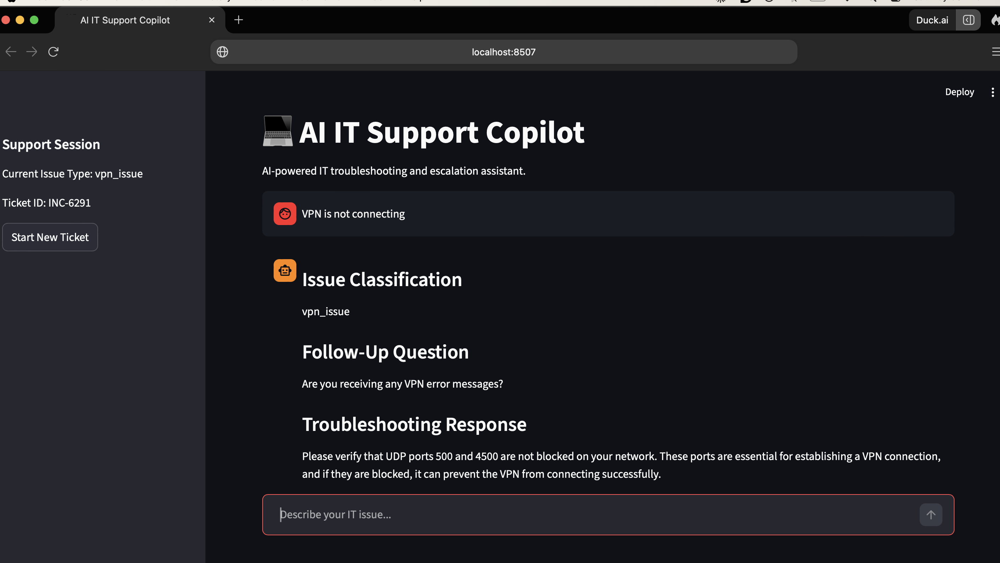
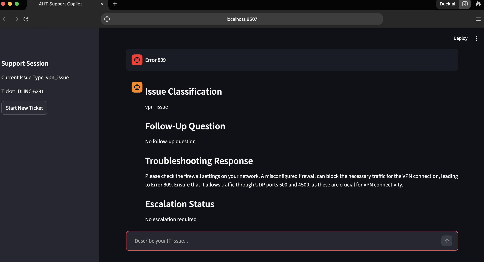
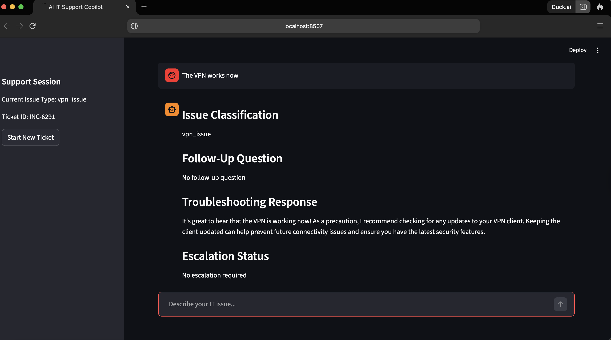
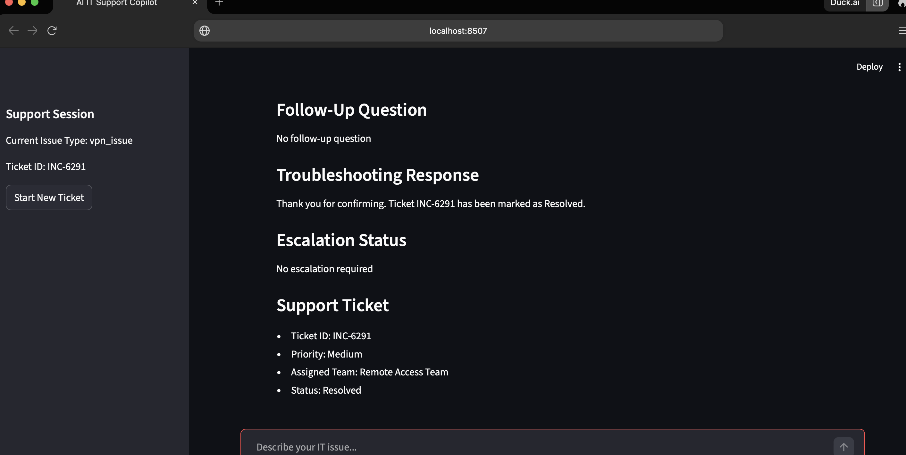

# AI IT Support Copilot

An AI powered IT support assistant designed to simulate how a real helpdesk interaction unfolds from the first user message through troubleshooting, ticket management, escalation, and ticket resolution.

Working in IT support exposed me to the challenges of troubleshooting, ticket management, and user support. This project was my way of exploring how AI could assist with those workflows while also helping me deepen my understanding of AI engineering and workflow automation.

Most AI support demos focus on generating answers. Real support environments are more complex. Support engineers need to gather information, ask follow up questions, consult documentation, track incidents, and decide when escalation is necessary.

The goal of this project was to build something that behaves more like an actual support workflow rather than a simple chatbot.

---

## Workflow Architecture

The application follows a structured support process:

```text
User Issue
    ↓
Issue Classification
    ↓
Knowledge Retrieval
    ↓
Follow Up Questions
    ↓
Troubleshooting Guidance
    ↓
Ticket Lifecycle Management
    ↓
Escalation Decision
```

The workflow is orchestrated using LangGraph, allowing each stage to behave as an independent support process.

---

## Issue Classification and Triage

When a user reports an issue, the assistant first identifies the problem category, generates a support ticket, and asks a relevant follow up question.

This example shows a VPN connectivity issue being classified before troubleshooting begins.



---

## Knowledge Based Troubleshooting

After receiving additional information, the assistant retrieves relevant troubleshooting guidance from the knowledge base and continues the investigation.

The current knowledge base contains support guidance for:

* VPN Issues
* Password Resets
* Microsoft 365
* Outlook
* Active Directory
* Printer Support
* General IT Support

Example using VPN Error 809:



---

## Ticket Lifecycle Management

The assistant maintains conversation context throughout the support session.

As troubleshooting progresses, ticket status automatically changes from Open to In Progress and later to Awaiting Confirmation when the user reports that the issue appears to be fixed.



---

## Ticket Resolution

Once the user confirms the issue has been resolved, the ticket is automatically updated and marked as Resolved.

This creates a more realistic support workflow where incidents move through a lifecycle rather than ending after a single response.



---

## Current Features

* Issue classification and triage
* Context aware follow up questions
* Knowledge base retrieval
* Multi step troubleshooting workflows
* Conversation memory
* Ticket generation
* Ticket lifecycle tracking
* Escalation handling
* Persistent ticket IDs
* LangGraph workflow orchestration
* Streamlit user interface
* OpenAI powered troubleshooting guidance

---

## Tech Stack

* Python
* Streamlit
* LangGraph
* OpenAI
* Session State Management
* Knowledge Base Retrieval
* Python Dotenv

---

## What I Learned Building This

The AI responses were actually the easiest part.

Most of the work went into solving problems that are easy to overlook when watching AI demos:

* Managing state across conversations
* Preserving context between messages
* Preventing issue reclassification during follow up messages
* Handling ticket lifecycle updates
* Designing reliable workflows
* Connecting knowledge retrieval with troubleshooting recommendations
* Handling incomplete user input

Building these pieces taught me far more about application design than prompt engineering alone.

---

## Project Structure

```bash
AI-IT-Support-Copilot/

├── streamlit_app.py
├── workflow.py
├── state.py
├── ticketing.py
├── llm.py
├── knowledge_base/
├── nodes/
├── screenshots/
├── requirements.txt
└── README.md
```

---

## Installation

Clone the repository:

```bash
git clone https://github.com/yourusername/AI-IT-Support-Copilot.git
```

Move into the project directory:

```bash
cd AI-IT-Support-Copilot
```

Install dependencies:

```bash
pip install -r requirements.txt
```

Create a `.env` file:

```env
OPENAI_API_KEY=your_api_key_here
```

Run the application:

```bash
streamlit run streamlit_app.py
```

---

## Current Development Focus

The project is still actively evolving.

Current areas of focus include:

* Improved knowledge retrieval
* More advanced RAG implementation
* Better escalation logic
* Persistent ticket storage
* Authentication
* Database integration
* Analytics and reporting

---

## Future Improvements

* Vector based retrieval
* Embedding powered search
* SQLite integration
* Supabase integration
* Microsoft Teams integration
* Slack integration
* Multi user support
* Admin dashboard
* Analytics and reporting
* Voice enabled support workflows

---

## Disclaimer

This project was built for learning, experimentation, and portfolio development.

It is not intended to replace enterprise ITSM platforms such as ServiceNow or Jira Service Management.

---

## Feedback

The project is still evolving as I continue learning more about AI workflows, automation, and IT operations.

Suggestions, ideas, and feedback are always welcome.
